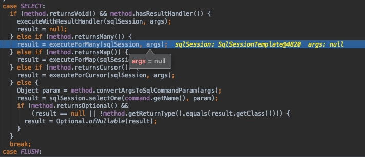
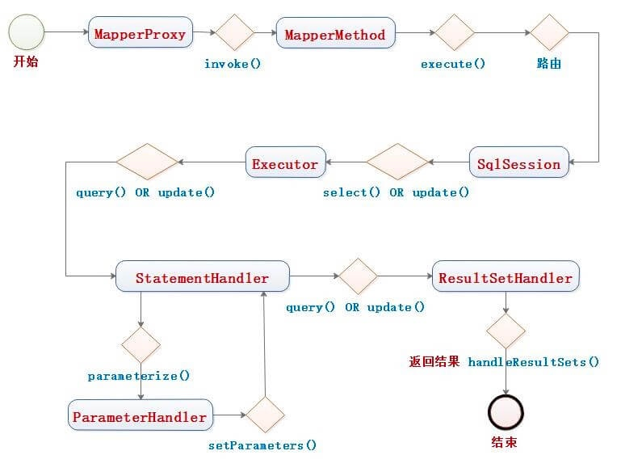
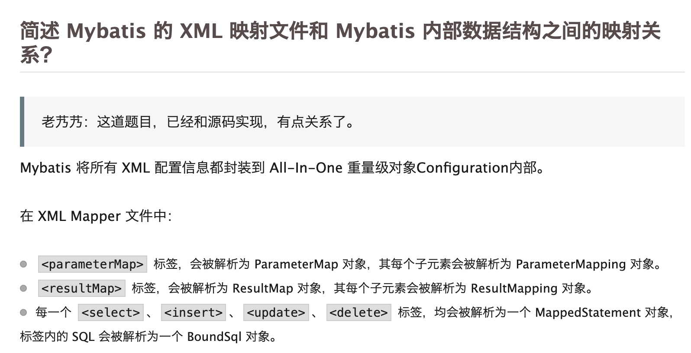

# MyBatis源码阅读
## 前言
* SqlSession：mybatis最核心的组件，可以发送sql去执行并返回结果，也可以获取Mapper接口。类似于jdbc的Connection对象
* SqlSessionFactory：创建SqlSession的工厂类，包含所有创建SqlSession实例的方法
* SqlSessionFactoryBuilder: 根据配置信息Configuration或代码构建SqlSessionFactory对象
* SQL Mapper：由Java接口和xml文件构成，并给出对应的sql和映射规则，负责发送sql执行并返回

## 正文
直接看到MybatisAutoConfiguration类，看上面的注解可以看到首先会注入一个MybatisProperties类，而这个类就是会将我们的配置文件中，mybatis前缀的参数都注入。
同时再看到一行注解
````
@ConditionalOnClass({ SqlSessionFactory.class, SqlSessionFactoryBean.class })
````
同样的，先创建两个实体类，所以我们先看到SqlSessionFactory类。
可以看到在源码看到，有一个生成SqlSessionFactory的方法，然后传入参数Datasource，断点调试可以看到这个是HikariDataSource的子类实现。
然后在这个方法里注意一段代码
````
if (configuration != null && !CollectionUtils.isEmpty(this.configurationCustomizers)) {
  for (ConfigurationCustomizer customizer : this.configurationCustomizers) {
    customizer.customize(configuration);
  }
}
````
这段其实就是编码自定义数据库中表字段名称和java程序中字段名称的对应关系。
同时在往下看，能看到还有一个Bean待生成，就是sqlSessionTemplate，并且这个类是以SqlSessionFactory为入参进行生成。

最后真正执行的SqlSession里的executor,一般执行的是BaseExecutor，缓存相关的是会生成一个缓存的key，然后直接从缓存或者从数据库中获取


## 总结
MyBatis一级缓存的生命周期和SqlSession一致。
MyBatis一级缓存内部设计简单，只是一个没有容量限定的HashMap，在缓存的功能性上有所欠缺。
MyBatis的一级缓存最大范围是SqlSession内部，有多个SqlSession或者分布式的环境下，数据库写操作会引起脏数据，建议设定缓存级别为Statement。


一级缓存可能有脏读，因为缓存只存在于一个SqlSession中，而二级缓存可以解决这个问题，源码上的区别就在于一级缓存用的是BaseExecutor，而二级是用的CacheExecutor，通过cacheEnable来开启二级缓存。


Mapper的注入是用的工厂类getObject方法，先getSqlSession,再getMapper

1：sqlSessionFactory，SQLSessionTemplate，MapperProxy注入
2：getSqlSession，Executor具体执行代码


获取Mapper的过程，必须先getSqlSession，同时SqlSession线程隔离，是通过ThreadLocal实现的，。


注意一下MybatisFacotyBean

同时会生成一个MapperProxy，里面会有一个MethodCache，每次进来的时候会有缓存，同时生成methodSignature。最后真正执行的是MapperMethod类
注意此时还是java代码层面，接下来需要知道执行的这个方法所对应的sql语句是什么类型。这个在Configuration类中都已经被解析过了。


注意仅仅是一个select语句，都会有很多执行场景。
然后进入方法，执行sqlSession具体select语句，具体在Configuration里的statement中的boundSql。然后再交由Executor来执行，有两种子类，Cache或者base，Cache的也就是相当于装饰模式，嵌套了一个清理缓存的功能，然后再执行Base的代码实现。再交由PrepareStatement来执行，同时会用resultSetHandler来处理结果集。





## Mybatis 都有哪些 Executor 执行器？它们之间的区别是什么？
Mybatis 有四种 Executor 执行器，分别是 SimpleExecutor、ReuseExecutor、BatchExecutor、CachingExecutor 。

* SimpleExecutor ：每执行一次 update 或 select 操作，就创建一个 Statement 对象，用完立刻关闭 Statement 对象。
* ReuseExecutor ：执行 update 或 select 操作，以 SQL 作为key 查找缓存的 Statement 对象，存在就使用，不存在就创建；用完后，不关闭 Statement 对象，而是放置于缓存 Map<String, Statement> 内，供下一次使用。简言之，就是重复使用 Statement 对象。
* BatchExecutor ：执行 update 操作（没有 select 操作，因为 JDBC 批处理不支持 select 操作），将所有 SQL 都添加到批处理中（通过 addBatch 方法），等待统一执行（使用 executeBatch 方法）。它缓存了多个 Statement 对象，每个 Statement 对象都是调用 addBatch 方法完毕后，等待一次执行 executeBatch 批处理。实际上，整个过程与 JDBC 批处理是相同。
* CachingExecutor ：在上述的三个执行器之上，增加二级缓存的功能。



