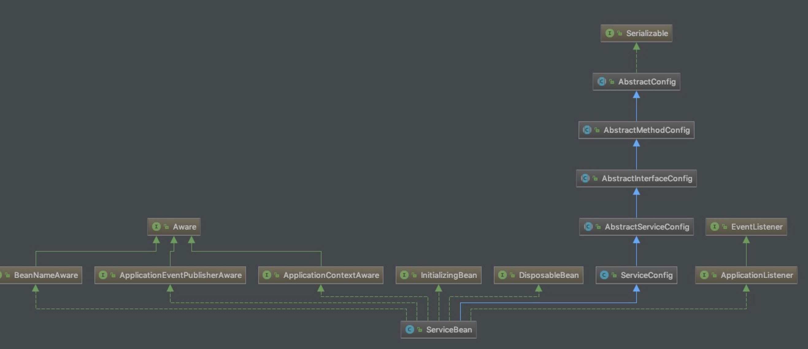

# dubbo(二)--服务暴露
## 前言
#### 前一篇文章捋了一遍dubbo中spi的扩展机制。这篇文章我们将来看一下dubbo中的服务暴露是什么意思。
## 正文
#### 因为dubbo本质就是一个rpc的调用过程，也就是会有服务的提供者和调用者。服务暴露就是提供者将自己的服务暴露在调用者能调用到的地方去。
#### 以spring配置的方式为例，
#### 我们会在提供者的项目中配置这么一个文件，这个文件最后会被对象化为ServiceBean中，这个类的继承关系如图
#### 可以看到，除了Spring的一些接口外，主要继承了ServiceConfig。这也是我们今天要重点看的类。所有我们之前的配置文件都会对应这个类中的一个变量，例如methods，interfaceName，interfaceClass。还有两句
```
    private static final Protocol protocol = ExtensionLoader.getExtensionLoader(Protocol.class).getAdaptiveExtension();

    private static final ProxyFactory proxyFactory = ExtensionLoader.getExtensionLoader(ProxyFactory.class).getAdaptiveExtension();
```
#### 看过之前的SPI文章的话，是不是秒懂这个语句是什么意思。所以直接跳过这句，最后得到的对应的扩展类分别是DubboProtocol和JavassistProxyFactory。好了，现在正式进入到我们的主角。看到export()方法，正式这个方法帮我们把配置的类和接口暴露出来。在看代码之前先提一句，暴露分为本地暴露和远程暴露，都属于指定的接口的子类实现，远程的类名叫 XXXStub，本地的类叫XXXLocal
```
public synchronized void export() {
        if (provider != null) {
            if (export == null) {
            	// 配置中是否配置了需要暴露服务
                export = provider.getExport();
            }
            if (delay == null) {
            	// 配置中是否配置了延迟发布
                delay = provider.getDelay();
            }
        }
        if (export != null && !export) {
            return;
        }
		// 如果延迟发布，则调用一个延迟线程进行发布
        if (delay != null && delay > 0) {
            delayExportExecutor.schedule(new Runnable() {
                @Override
                public void run() {
                    doExport();
                }
            }, delay, TimeUnit.MILLISECONDS);
        } else {
            doExport();
        }
    }
```
#### 上面的代码也很容易理解，就是得到一些用户配置的变量。并按要求确定是否发布以及是否延迟发布。所以重点是doExport()方法

