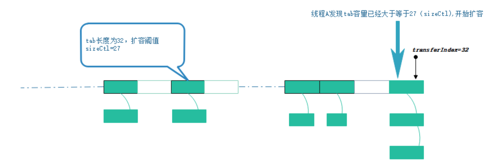
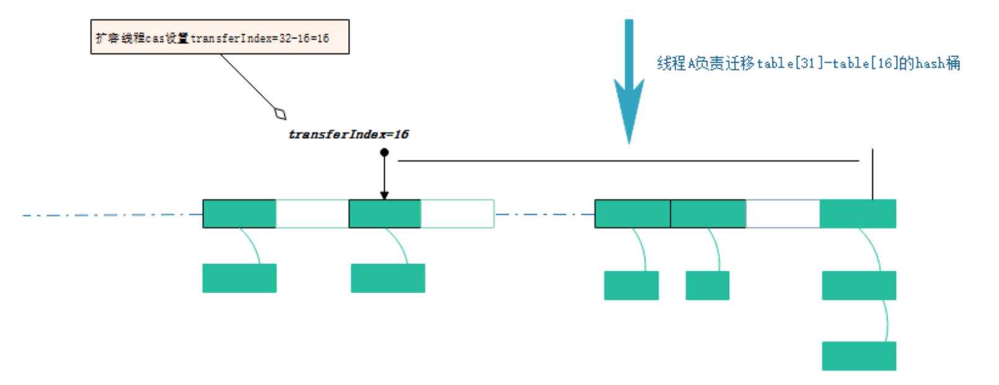

# ConcurrentHashmap 的transfer方法

## 前文
#### 
多线程之间，以volatile的方式读取sizeCtl属性，来判断ConcurrentHashMap当前所处的状态。通过cas设置sizeCtl属性，告知其他线程ConcurrentHashMap的状态变更。
不同状态，sizeCtl所代表的含义也有所不同。

未初始化：

sizeCtl=0：表示没有指定初始容量。
sizeCtl>0：表示初始容量。


初始化中：

sizeCtl=-1,标记作用，告知其他线程，正在初始化

正常状态：

sizeCtl=0.75n ,扩容阈值

扩容中:

sizeCtl < 0 : 表示有其他线程正在执行扩容
sizeCtl = (resizeStamp(n) << RESIZE_STAMP_SHIFT) + 2    :表示此时只有一个线程在执行扩容


## 正文
#### 本文会解释一下在jdk 1.8中的ConcurrentHashMap是怎么并发的进行扩容的。为了描述这一过程，我们会先看到put方法中，因为当put过程中，发现元素大小超过了阈值的时候，线程才会去对底层数组进行扩容。直接看到putVal方法中，为了节省篇幅，会省去一些不必要的代码
```
final V putVal(K key, V value, boolean onlyIfAbsent) {
        ... 
        for (Node<K,V>[] tab = table;;) {
            Node<K,V> f; int n, i, fh;
            if (tab == null || (n = tab.length) == 0)
                ...
            else if ((f = tabAt(tab, i = (n - 1) & hash)) == null) {
    			...            
            }
            else if ((fh = f.hash) == MOVED)
                tab = helpTransfer(tab, f);
            else {
            	// 在链表后面添加节点，先省略了
                ...
            }
                if (binCount != 0) {
                    if (binCount >= TREEIFY_THRESHOLD)
                        treeifyBin(tab, i);
                    if (oldVal != null)
                        return oldVal;
                    break;
                }
            }
        }
        addCount(1L, binCount);
        return null;
    }
```
#### 注意上面代码中我留下的几块方法。我们一个个解释。先看到helpTransfer方法。可以看到，要进入到方法的条件是要将值put到的对应的桶位的节点存在，而且hash值为MOVED，也就是-1。全局搜索之后，可以发现只有一个地方会创建这种节点
```
	static final class ForwardingNode<K,V> extends Node<K,V> {
        final Node<K,V>[] nextTable;
        ForwardingNode(Node<K,V>[] tab) {
            super(MOVED, null, null, null);
            this.nextTable = tab;
        }
        
        Node<K,V> find(int h, Object k) {
   			... 
        }
    }
```
#### 可以看到，这一块是将对应的桶变成了一个ForwardingNode (以下简称fwn)，这边先剧透以下，变成这个节点就代表当前桶位正在进行扩容迁移。所以我们回到刚才那个语句
```
	else if ((fh = f.hash) == MOVED)
        tab = helpTransfer(tab, f);
```
#### 可以看到如果一个线程在put的时候，发现当前正在进行扩容，他甚至是可以帮忙一起扩容的,跟进去会看到会调用到transfer方法。这也是Cmap一个非常高效的理由。
#### 再往下看到第二处留下的代码块，这段和HashMap中非常相似，也是如果某个桶位的链表长度大于等于了8，就会尝试进行树化，同样的，在里面也会进行判断，如果此时底层数组的大小还没大于64，则会先进行扩容。
```
	private final void treeifyBin(Node<K,V>[] tab, int index) {
        Node<K,V> b; int n, sc;
        if (tab != null) {
            if ((n = tab.length) < MIN_TREEIFY_CAPACITY)
                tryPresize(n << 1);
            else if ((b = tabAt(tab, index)) != null && b.hash >= 0) {
   				... 
            }
        }
    }
```
#### 如果你跟进去tryPresize方法，你会看到里面实际起作用的地方也是transfer方法
#### 再直接看到上面留下的最后一段代码 addCount(1L, binCount);，跟进去可以看到
```
private final void addCount(long x, int check) {
        ...
       if (check >= 0) {
            Node<K,V>[] tab, nt; int n, sc;
            while (s >= (long)(sc = sizeCtl) && (tab = table) != null &&
                   (n = tab.length) < MAXIMUM_CAPACITY) {
                int rs = resizeStamp(n);
                if (sc < 0) {
                    if ((sc >>> RESIZE_STAMP_SHIFT) != rs || sc == rs + 1 ||
                        sc == rs + MAX_RESIZERS || (nt = nextTable) == null ||
                        // 重点
                        transferIndex <= 0)
                        break;
                    if (U.compareAndSwapInt(this, SIZECTL, sc, sc + 1))
                        transfer(tab, nt);
                }
                else if (U.compareAndSwapInt(this, SIZECTL, sc,
                                             (rs << RESIZE_STAMP_SHIFT) + 2))
                    transfer(tab, null);
                s = sumCount();
            }
        }
    }
```
#### 也就是说，如果节点数大于了阈值，就会进行transfer方法，也就是扩容。
#### 好了以上三段逻辑，最后都回到了transfer方法，也就是我们今天想要讲到的地方。
#### 我们开始进入到transfer方法的世界
```
    int n = tab.length, stride;
    if ((stride = (NCPU > 1) ? (n >>> 3) / NCPU : n) < MIN_TRANSFER_STRIDE)
        stride = MIN_TRANSFER_STRIDE; // subdivide range
            
```
#### 在方法开始的时候，会得到一个叫做stride的参数。这个参数是指定每个线程可以负责多少个桶。从代码中也可以知道，若当前机器的cpu核数大于1的时候，每个线程负责 n/(8 * 核数)。其中每个线程最小也需要负责16个桶。接下去看
```
	if (nextTab == null) {            // initiating
        try {
            @SuppressWarnings("unchecked")
            Node<K,V>[] nt = (Node<K,V>[])new Node<?,?>[n << 1];
            nextTab = nt;
        } catch (Throwable ex) {      // try to cope with OOME
            sizeCtl = Integer.MAX_VALUE;
            return;
        }
        nextTable = nextTab;
        transferIndex = n;
    }
```
#### 如果新的数组还未初始化，则需要先初始化一下。新数组大小是旧数组的2倍。
```
    int nextn = nextTab.length;
    ForwardingNode<K,V> fwd = new ForwardingNode<K,V>(nextTab);
    boolean advance = true;
    boolean finishing = false; // to ensure sweep before committing nextTab
```
#### 规定一些参数。继续往下，会看到一个for循环
```
	for (int i = 0, bound = 0;;) {
	    Node<K,V> f; int fh;
	    while (advance) {
	        int nextIndex, nextBound;
	        if (--i >= bound || finishing)
	            advance = false;
	        else if ((nextIndex = transferIndex) <= 0) {
	            i = -1;
	            advance = false;
	        }
	        else if (U.compareAndSwapInt
	                 (this, TRANSFERINDEX, nextIndex,
	                  nextBound = (nextIndex > stride ?
	                               nextIndex - stride : 0))) {
	            bound = nextBound;
	            i = nextIndex - 1;
	            advance = false;
	        }
	    }
	    ... 
	}
```
#### 这一块注意几个关键的属性transferIndex，nextIndex，nextBound。具体逻辑可以看到这个链接的内容，讲的非常好。
[扩容方法的属性](https://www.jianshu.com/p/487d00afe6ca)
#### 通过上面的for循环之后，我们就可以继续我们接下来的实际迁移过程了。借用上面链接里的几幅图进行理解


#### 可以得到现在
```
nextBound = 16,
nextIndex = 32,
i = nextIndex -1 = 31
```
