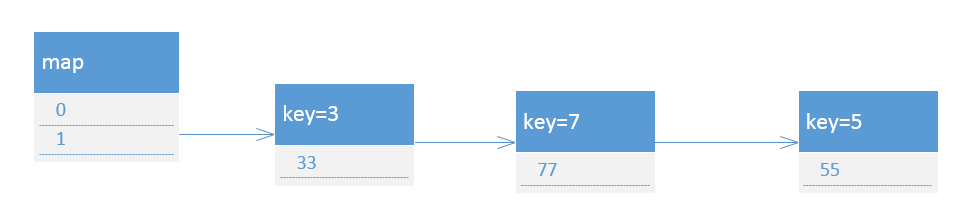
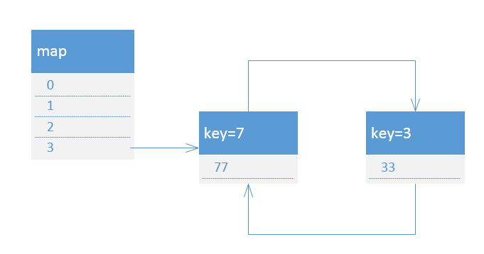

# HashMap 1.7 版本的transfer方法
```
	void transfer(Entry[] newTable) {
      Entry[] src = table; 

      int newCapacity = newTable.length;

      for (int j = 0; j < src.length; j++) { 
          Entry<K,V> e = src[j];           
          if (e != null) {
              src[j] = null; 

              do { 
                 Entry<K,V> next = e.next; 
                 int i = indexFor(e.hash, newCapacity); 
                 e.next = newTable[i]; 
                 newTable[i] = e;  
                 e = next;             
             } while (e != null);
         }
     }
 	}
	
	
	
	 static int indexFor(int h, int length) {  
          return h & (length-1); 
   	 }
```


newTable和src
遍历src中的所有桶位，如果存在链表节点，则需要遍历所有节点，用首插法的方式，将节点都移动到新的数组中。这边举一个例子，假设初始数组大小是2


线程1开始后，线程2开始transfer，并已经结束。就会造成死循环

这时候如果调用get方法，则会一直在死循环中
