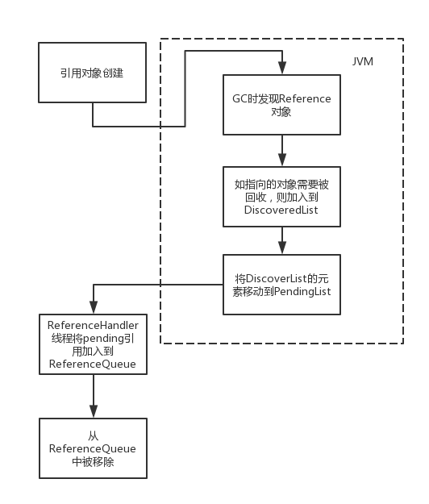

# 堆外内存
和堆内内存相对应，堆外内存就是把内存对象分配在Java虚拟机的堆以外的内存，这些内存直接受操作系统管理（而不是虚拟机），这样做的结果就是能够在一定程度上减少垃圾回收对应用程序造成的影响。


二、使用堆外内存的优点

1、减少了垃圾回收
因为垃圾回收会暂停其他的工作。
2、加快了复制的速度
堆内在flush到远程时，会先复制到直接内存（非堆内存），然后在发送；而堆外内存相当于省略掉了这个工作。
同样任何一个事物使用起来有优点就会有缺点，堆外内存的缺点就是内存难以控制，使用了堆外内存就间接失去了JVM管理内存的可行性，改由自己来管理，当发生内存溢出时排查起来非常困难


-XX:MaxDirectMemorySize来指定最大的堆外内存大小
如果没设置-XX:MaxDirectMemorySize，则默认与-Xmx参数值相同


2、System.gc的作用有哪些
说起堆外内存免不了要提及System.gc方法，下面就是使用了System.gc的作用是什么？

做一次full gc
执行后会暂停整个进程。
System.gc我们可以禁掉，使用-XX:+DisableExplicitGC，
其实一般在cms gc下我们通过-XX:+ExplicitGCInvokesConcurrent也可以做稍微高效一点的gc，也就是并行gc。
最常见的场景是RMI/NIO下的堆外内存分配等


DirectByteBuffer
JDK中使用DirectByteBuffer对象来表示堆外内存，每个DirectByteBuffer对象在初始化时，都会创建一个对用的Cleaner对象，这个Cleaner对象会在合适的时候执行unsafe.freeMemory(address)，从而回收这块堆外内存。


用堆外内存和UNSAFE的内存泄漏问题，可以用下面这个例子解释一下

```
	// -verbose:gc -XX:+PrintGCDetails -XX:MaxDirectMemorySize=40M
	public static void main(String[] args) throws InterruptedException{
        while (true)
        {
            ByteBuffer buffer = ByteBuffer.allocateDirect(10 * 1024 * 1024);
        }
    }
```
#### 用上面这一段代码不停的进行堆外内存的分配的时候，是不会造成OOM的，而是会非常频繁的产生GC

```
	public static void main(String[] args) throws Exception{
		Unsafe unsafe = GetUsafeInstance.getUnsafeInstance();
 
		while (true)
		{
			long pointer = unsafe.allocateMemory(1024 * 1024 * 20);
			System.out.println(unsafe.getByte(pointer + 1));
 
			// 如果不释放内存,运行一段时间会报错java.lang.OutOfMemoryError
			// unsafe.freeMemory(pointer);
		}
	}
```
#### 而如果是用上面这一段代码的话，很快就会OOM异常。这是因为在jvm分配对象的时候，会有内置的垃圾回收器不停的帮我们回收不可用的对象，但是堆外内存显然是不受这个控制的。用UNSAFE分配内存，其实底层调用的还是C语言的malloc命令，我们知道在C语言中，对象必须都是由程序自主的释放的，也就是用free。所以如果UNSAFE使用不当，很容易会造成内存泄漏问题
#### 再说回ByteBuffer类，为什么这个不会有问题呢？这个是因为在类的包装中，不但考虑到了malloc，还会在合适的时候进行free。这也就是我们接下来想要讨论的，java是怎么监控到堆外内存的生命周期呢？


DirectByteBuffer构造方法中还做了挺多事情的，总的来说分为几个步骤：

预分配内存
分配内存
将刚分配的内存空间初始化为0
创建一个cleaner对象，Cleaner对象的作用是当DirectByteBuffer对象被回收时，释放其对应的堆外内存

```
    cleaner = Cleaner.create(this, new Deallocator(base, size, cap));

```

cleaner 是一个虚引用类型，然后内部还会有一个Runnable类型的对象，在释放内存的时候被调用
Cleaner.create被调用的时候，会在内部组成一个cleaner的链路


简单的说，就是当字段referent(也就是DirectByteBuffer对象)被回收时，会调用到Cleaner#clean方法，最终会调用到Deallocator#run进行堆外内存的回收。

Cleaner是虚引用在JDK中的一个典型应用场景。

在创建一个新的DirecByteBuffer时，会先确认有没有足够的内存，如果没有的话，会通过一些手段回收一部分堆外内存，直到可用内存大于需要分配的内存。具体步骤如下：

如果可用堆外内存足够，则直接返回
调用tryHandlePendingReference方法回收已经变成垃圾的DirectByteBuffer对象对应的堆外内存，直到可用内存足够，或目前没有垃圾DirectByteBuffer对象
触发一次full gc，其主要目的是为了防止’冰山现象‘：一个DirectByteBuffer对象本身占用的内存很小，但是它可能引用了一块很大的堆外内存。如果DirectByteBuffer对象进入了老年代之后变成了垃圾，因为老年代GC一直没有触发，导致这块堆外内存也一直没有被回收。需要注意的是如果使用参数-XX:+DisableExplicitGC，那System.gc();是无效的
重复1，2步骤的流程，直到可用内存大于需要分配的内存
如果超出指定次数还没有回收到足够内存，则OOM


tryHandlePendingReference最终调用到的是Reference#tryHandlePending

可以看到，tryHandlePendingReference的最终效果就是：如果有垃圾DirectBytebuffer对象，则调用对应的Cleaner#clean方法进行回收。clean方法在上面已经分析过了。




refs_lists中存放了本次GC发现的某种引用类型（虚引用、软引用、弱引用等），而process_discovered_reflist方法的作用就是将不需要被回收的对象从refs_lists移除掉，refs_lists最后剩下的元素全是需要被回收的元素，最后会将其第一个元素赋值给上文提到过的Reference.java#pending字段。
判断是不是需要回收是由一个ReferencePolicy决定的，有四种实现方式
NeverClearPolicy，AlwaysClearPolicy，LRUCurrentHeapPolicy，LRUMaxHeapPolicy


软引用默认使用LRUCurrentHeapPolicy

参考图中的得到DiscoveredList后，会再进行一步将不需要被回收的对象从refs_lists移除的操作。上面说过，如果是软引用，会有policy来进行判断是否被回收。如果是虚引用，或者是弱引用，则不会有这个policy。


强引用： 如果有指向，永远不会被回收
软引用：跟堆内存和get方法被调用的时间有关，在jvm的gc过程中会调用LRUCurrentHeapPolicy来进行判断
弱引用：不存在policy判断，只要进行内存回收，都会直接被回收
虚引用：指向的对象永远不会被回收，虚引用的get方法也不会得到相应的对象，可以传入一个队列，只是作为当对象被回收后的指示。


> 2.网上对于虚引用的介绍是：形同虚设，与其他几种引用都不同，虚引用并不会决定对象的生命周期。主要用来跟踪对象被垃圾回收器回收的活动。真的是这样吗？

> 严格的说，虚引用是会影响对象生命周期的，如果不做任何处理，只要虚引用不被回收，那其引用的对象永远不会被回收。所以一般来说，从ReferenceQueue中获得PhantomReference对象后，如果PhantomReference对象不会被回收的话（比如被其他GC ROOT可达的对象引用），需要调用clear方法解除PhantomReference和其引用对象的引用关系。

怎么理解？