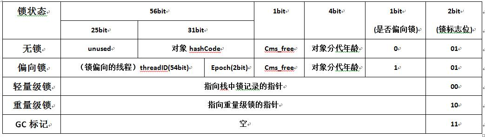

# java中的对象头
## 正文
#### 我们知道每个对象在实例化分配的时候，都是分配在堆内存中的。每个对象在堆中的内存区间存储的时候，都是分为三块地方
- 对象头
- 实例属性
- 填充属性

#### 今天我们就要去探究一下，在对象头中存储的东西有什么。
#### 在堆中的对象头中，主要是由两个部分组成的，那就是markword和klass point。其中klass point是指向实例对象的类对象的指针，jvm就是通过这个指针来确定该实例是属于哪个类的。而mark word是为了标识一些在运行时的一些动态数据，如果是数组对象，则对象头占3个字宽，因为还需要存储一份数组的长度，如果是非数组对象，则占2个字宽。具体内容如下图所示
32位虚拟机对象头

64位虚拟机对象头
