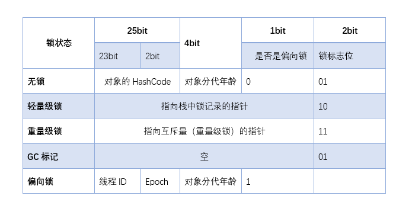

# 锁膨胀
#### 每个对象在堆中分配的时候，都会有一个对象头。里面就包含了关于锁的信息

## 锁的膨胀过程
### 无锁 --> 偏向锁
#### 所有对象新分配的时候，都处于可偏向的状态。即对象头中的可偏向bit为0。所以当第一个线程过来竞争的时候，发现是可偏向的时候，就会CAS的方式，去将对象头的ThreadId改成自己的。在当前线程在第二次去竞争的时候，发现ThreadId已经是自己，就会免去CAS的过程，直接得到对象。
### 偏向锁 --> 轻量锁
#### 偏向锁是不会主动撤销的，所以当此时第二个线程发起竞争的时候，会发现对象头中的ThreadId不是自己，所以会先去检查该线程是否还存活，若时，则直接将偏向锁变回无锁状态，再CAS将对象头中改为新ThreadId，表示竞争到了偏向锁。但是如果旧线程还存活，则要去检查线程中的栈帧中，是否还需要需要占有偏向锁。如果需要，则需要将偏向锁升级为轻量锁。
### 轻量锁 --> 重量锁
#### 轻量级锁认为竞争存在，但是竞争的程度很轻，一般两个线程对于同一个锁的操作都会错开，或者说稍微等待一下（自旋），另一个线程就会释放锁。 但是当自旋超过一定的次数，或者一个线程在持有锁，一个在自旋，又有第三个来访时，轻量级锁膨胀为重量级锁，重量级锁使除了拥有锁的线程以外的线程都阻塞，防止CPU空转。

