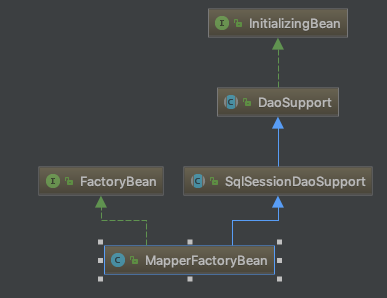

# Mybatis + Springboot系列(七) 
## 前文
#### 本文我们来回头看看我们之前提到过的MapperFactoryBean这个类，再分享一点之前没提到过的细节问题。
## 正文
#### 先看一下MapperFactoryBean的继承关系图

#### 可以看到实现了initialzingBean和factoryBean的接口，同时继承了DaoSuppport和SqlSessionDaoSupport两个父类，关于实现的接口类在此先不做详细说明了，都属于spring-boot的原生接口，主要看一下这两个父类做了什么事。
#### 先看一下DaoSupport类
````
	@Override
	public final void afterPropertiesSet() throws IllegalArgumentException, BeanInitializationException {
		// Let abstract subclasses check their configuration.
		checkDaoConfig();

		// Let concrete implementations initialize themselves.
		try {
			initDao();
		}
		catch (Exception ex) {
			throw new BeanInitializationException("Initialization of DAO failed", ex);
		}
	}
````
#### 注意看到，afterPropertiesSet里面会调用两个很重要的方法，这两个方法在这一层父类中都是抽象出来的，由子类去具体实现。所以我们再看到SqlSessionDaoSupport类中对这两个方法具体实现了什么逻辑。
````
  @Override
  protected void checkDaoConfig() {
    notNull(this.sqlSessionTemplate, "Property 'sqlSessionFactory' or 'sqlSessionTemplate' are required");
  }
````
#### 同样很简单的只是校验了一下sqlSessionTemplate是否被成功注入，所以我们要再看到子类具体怎么实现的。
````
  @Override
  protected void checkDaoConfig() {
  	// 调用SqlSessionDaoSupport中实现的方法，校验sqlSessionTemplate是非为空
    super.checkDaoConfig();

    notNull(this.mapperInterface, "Property 'mapperInterface' is required");
	// 得到当前sqlSession中的Configuration类，这个类在我们之前的文章中具体讲过，是包含所有接口和sql属性的配置类
    Configuration configuration = getSqlSession().getConfiguration();
    if (this.addToConfig && !configuration.hasMapper(this.mapperInterface)) {
      try {
      	// 如果满足添加的要求的话，在Configuration中注册这个mapper类
        configuration.addMapper(this.mapperInterface);
      } catch (Exception e) {
        logger.error("Error while adding the mapper '" + this.mapperInterface + "' to configuration.", e);
        throw new IllegalArgumentException(e);
      } finally {
        ErrorContext.instance().reset();
      }
    }
  }
````
#### 继续看到这个addMapper方法做了什么
````
  public <T> void addMapper(Class<T> type) {
    mapperRegistry.addMapper(type);
  }
  
  public <T> void addMapper(Class<T> type) {
    if (type.isInterface()) {
      if (hasMapper(type)) {
        throw new BindingException("Type " + type + " is already known to the MapperRegistry.");
      }
      boolean loadCompleted = false;
      try {
      	// knowMappers是一个map，所以放置一个对应的 clas - MapperProxyFactory的对应关系
        knownMappers.put(type, new MapperProxyFactory<>(type));
        // It's important that the type is added before the parser is run
        // otherwise the binding may automatically be attempted by the
        // mapper parser. If the type is already known, it won't try.
        MapperAnnotationBuilder parser = new MapperAnnotationBuilder(config, type);
        parser.parse();
        loadCompleted = true;
      } finally {
        if (!loadCompleted) {
        	// 如果注册过程没有全部完成，则需要及时移除
          knownMappers.remove(type);
        }
      }
    }
  }
````
#### 之后就可以从Configuration中获取需要的mapperFactoryProxy类了