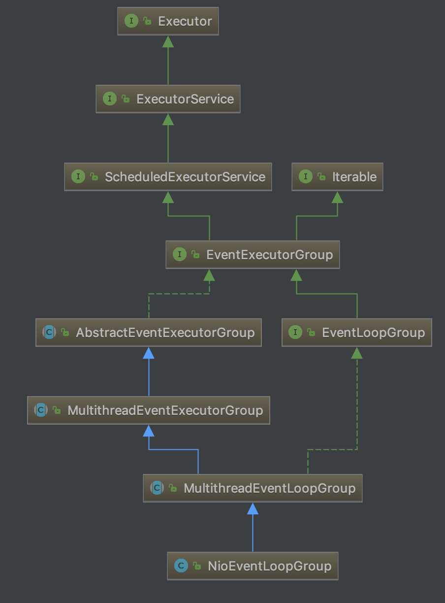

# netty 源码系列(二)  NioEventLoop
## 正文
#### ，所以我们直接看到NioEventLoopGroup对象的内容。直接看到NioEventLoopGroup的继承关系，我们会看到这个类其实是继承于jdk自带的线程池的定时调度模型的，这个对我们之后理解这个类的作用也非常有帮助。

#### 继续看到类的源码
````
public class NioEventLoopGroup extends MultithreadEventLoopGroup {

    /**
     * Create a new instance using the default number of threads, the default {@link ThreadFactory} and
     * the {@link SelectorProvider} which is returned by {@link SelectorProvider#provider()}.
     */
    public NioEventLoopGroup() {
        this(0);
    }

    /**
     * Create a new instance using the specified number of threads, {@link ThreadFactory} and the
     * {@link SelectorProvider} which is returned by {@link SelectorProvider#provider()}.
     */
    public NioEventLoopGroup(int nThreads) {
        this(nThreads, (Executor) null);
    }

    public NioEventLoopGroup(int nThreads, Executor executor) {
        this(nThreads, executor, SelectorProvider.provider());
    }

    public NioEventLoopGroup(
            int nThreads, Executor executor, final SelectorProvider selectorProvider) {
        this(nThreads, executor, selectorProvider, DefaultSelectStrategyFactory.INSTANCE);
    }

    public NioEventLoopGroup(int nThreads, Executor executor, final SelectorProvider selectorProvider,
                             final SelectStrategyFactory selectStrategyFactory) {
        super(nThreads, executor, selectorProvider, selectStrategyFactory, RejectedExecutionHandlers.reject());
    }
}
````
#### 几个构造函数的调用关系，最终我们会定位到一个调用了super的方法，先不急看到父类的内容，我们先梳理一下刚才的几个关键点。
- SelectorProvider.provider()
- DefaultSelectStrategyFactory.INSTANCE
- RejectedExecutionHandlers.reject()