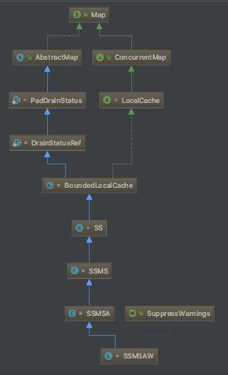

# Caffeine缓存
## 正文
#### 直接先看到一个简单的例子
```
	public static void main(String[] args) throws InterruptedException {
        Cache<String, String> cache = Caffeine.newBuilder()
                .expireAfterWrite(1, TimeUnit.SECONDS)
                .expireAfterAccess(1, TimeUnit.SECONDS)
                .maximumSize(10)
                .build();
        cache.put("hello","hello");
        Thread.sleep(2000);
        System.out.print(cache.getIfPresent("hello"));
    }
```

#### 和guava提供的那个cache的用法非常相似，很容易就知道最后会得到null，因为已经过期了。今天当然不是要看到这些，今天是要进到源码看一下里面是怎么实现的。我们逐句看一下

```
  @Nonnull
  public static Caffeine<Object, Object> newBuilder() {
    return new Caffeine<>();
  }
```

#### 得到一个Caffeine类型，用于后续的对过期时间的设置，再看到下一句

```
  @Nonnull
  public Caffeine<K, V> expireAfterWrite(@Nonnegative long duration, @Nonnull TimeUnit unit) {
    requireState(expireAfterWriteNanos == UNSET_INT,
        "expireAfterWrite was already set to %s ns", expireAfterWriteNanos);
    requireState(expiry == null, "expireAfterAccess may not be used with variable expiration");
    requireArgument(duration >= 0, "duration cannot be negative: %s %s", duration, unit);
    this.expireAfterWriteNanos = unit.toNanos(duration);
    return this;
  }
```

#### 除了前几句对参数的一些校验，重要的也就是一个赋值语句，expireAfterAccess方法也是一样，重要的就是

```
    this.expireAfterAccessNanos = unit.toNanos(duration);

```

#### maximumSize方法也是如此，

```
    this.maximumSize = maximumSize;
```

#### 所以是怎么实现了说比guava的缓存性能还要好的特性呢？看到下一句build

```
  @Nonnull
  public <K1 extends K, V1 extends V> Cache<K1, V1> build() {
    requireWeightWithWeigher();
    requireNonLoadingCache();

    @SuppressWarnings("unchecked")
    Caffeine<K1, V1> self = (Caffeine<K1, V1>) this;
    return isBounded() || refreshes()
        ? new BoundedLocalCache.BoundedLocalManualCache<>(self)
        : new UnboundedLocalCache.UnboundedLocalManualCache<>(self);
  }
```

#### 主要看到isBounded和refreshes方法，因为这两个方法决定了返回的是什么类型的缓存实例

```
  boolean isBounded() {
    return (maximumSize != UNSET_INT)
        || (maximumWeight != UNSET_INT)
        || (expireAfterAccessNanos != UNSET_INT)
        || (expireAfterWriteNanos != UNSET_INT)
        || (expiry != null)
        || (keyStrength != null)
        || (valueStrength != null);
  }
```

#### 可以看到这个方法是判断我们是不是自定义了一些参数，显然在一般情况下我们是返回true的，再看下一个

```
  boolean refreshes() {
    return refreshNanos != UNSET_INT;
  }
```

#### 这个方法是判断refreshNanos参数是否被设置过，这个场景下我们是没有配置过的，返回false。所以结合这两个返回值，我们最终返回的子类是BoundedLocalCache.BoundedLocalManualCache<>()。

```
	BoundedLocalManualCache(Caffeine<K, V> builder, @Nullable CacheLoader<? super K, V> loader) {
      cache = LocalCacheFactory.newBoundedLocalCache(builder, loader, /* async */ false);
      isWeighted = builder.isWeighted();
    }
```

#### 进一步看到这一句cache的赋值是得到了什么

```
static <K, V> BoundedLocalCache<K, V> newBoundedLocalCache(Caffeine<K, V> builder,
      @Nullable CacheLoader<? super K, V> cacheLoader, boolean async) {
    StringBuilder sb = new StringBuilder("com.github.benmanes.caffeine.cache.");
    if (builder.isStrongKeys()) {
      sb.append('S');
    } else {
      sb.append('W');
    }
    if (builder.isStrongValues()) {
      sb.append('S');
    } else {
      sb.append('I');
    }
    if (builder.removalListener != null) {
      sb.append('L');
    }
    if (builder.isRecordingStats()) {
      sb.append('S');
    }
    if (builder.evicts()) {
      sb.append('M');
      if (builder.isWeighted()) {
        sb.append('W');
      } else {
        sb.append('S');
      }
    }
    if (builder.expiresAfterAccess() || builder.expiresVariable()) {
      sb.append('A');
    }
    if (builder.expiresAfterWrite()) {
      sb.append('W');
    }
    if (builder.refreshes()) {
      sb.append('R');
    }
    try {
      Class<?> clazz = LocalCacheFactory.class.getClassLoader().loadClass(sb.toString());
      Constructor<?> ctor = clazz.getDeclaredConstructor(Caffeine.class, CacheLoader.class, boolean.class);
      @SuppressWarnings("unchecked")
      BoundedLocalCache<K, V> factory = (BoundedLocalCache<K, V>) ctor.newInstance(builder, cacheLoader, async);
      return factory;
    } catch (ReflectiveOperationException e) {
      throw new IllegalStateException(sb.toString(), e);
    }
  }
```

#### 可以看到，是会根据我们之前设定的参数，通过字符串的方式得到相应的cache类型，
#### 所以我们看到下一句，往里面put会发生什么。大家可以自己调试一下，这里面可能有点绕，但是最后会落在上面定义的cache的put方法里。在我们这个场景下，最终我们会得到一个字符串 SSMSAW,这也就是我们最后的处理类。看到下面这个继承图，最后put方法还是会调回到BoundedLocalCache的put方法。同时也注意到，cache其实是map的一个实现子类，而且实现了COncurrentmap的接口


```
  @Override
  public @Nullable V put(K key, V value) {
    return put(key, value, expiry(), /* notifyWriter */ true, /* onlyIfAbsent */ false);
  }
  
  @Nullable V put(K key, V value, Expiry<K, V> expiry, boolean notifyWriter, boolean onlyIfAbsent) {
    requireNonNull(key);
    requireNonNull(value);

    Node<K, V> node = null;
    long now = expirationTicker().read();
    int newWeight = weigher.weigh(key, value);
  	......
  }
```

#### 先是对参数的一些校验，然后创建了一个node，接下来的代码逻辑才是最重要的。

```
	for (;;) {
      Node<K, V> prior = data.get(nodeFactory.newLookupKey(key));
      if (prior == null) {
        if (node == null) {
          node = nodeFactory.newNode(key, keyReferenceQueue(),
              value, valueReferenceQueue(), newWeight, now);
          setVariableTime(node, expireAfterCreate(key, value, expiry, now));
        }
        if (notifyWriter && hasWriter()) {
          Node<K, V> computed = node;
          prior = data.computeIfAbsent(node.getKeyReference(), k -> {
            writer.write(key, value);
            return computed;
          });
          if (prior == node) {
            afterWrite(new AddTask(node, newWeight));
            return null;
          }
        } else {
          prior = data.putIfAbsent(node.getKeyReference(), node);
          if (prior == null) {
            afterWrite(new AddTask(node, newWeight));
            return null;
          }
        }
      }
		......
	} 
```

